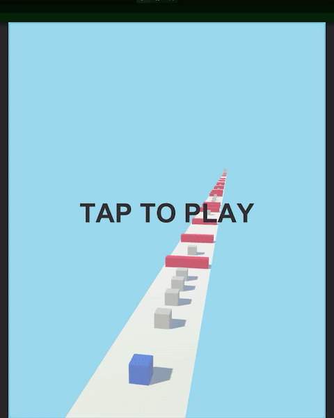

# cubestack

Нужно реализовать следующие механики:

1 На самом старте игра стоит на паузе, поверх экрана видна надпись “TAP TO PLAY”. Когда игрок тапнет на экран, надпись пропадёт и башня игрока поедет. 

2 Башня из кубов игрока перемещается автоматически по дорожке, едет вперёд.

3 Игрок теряет из своей башни куб при столкновении с вражеским кубом: потерянный куб врезается во вражеский и остается на месте, больше не считаются частью башни игрока. 

4 При столкновении с нейтральным кубом, игрок получает в свою башню дополнительный куб. При этом приобретенные кубы должны вставать в башне игрока снизу, а все прочие кубы игрока смещаются вверх.

5 Механика управления. Когда игрок нажимает пальцем на экран и отпускает его (делает быстрый или медленный тап), башня игрока делает прыжок, не прекращая своего движения вперед. Чем дольше игрок удерживает палец на экране, тем выше будет сила прыжка, когда он отпустит палец (но не выше, чем максимальный прыжок, т.е. есть ограничение прыжка по высоте).

6 Кубы в башне игрока должны быть синего цвета. Нейтральные кубы должны быть серого цвета. Вражеские кубы-препятствия должны быть красного цвета.

7 После того, как игрок теряет кубы, они должны становиться нейтральными - изменять свой цвет на серый. После того как игрок получает нейтральные кубы, они должны становиться частью структуры его вертикальной башни из кубов и менять свой цвет на синий.

8 Игрок проигрывает, если у него не осталось ни одного куба. После поражения игрока перезапускать уровень на стартовом экране.

9 Игрок выигрывает, если его башня добирается до зоны финиша на другом конце дорожки. После победы игрока перезапускать уровень на стартовом экране.
